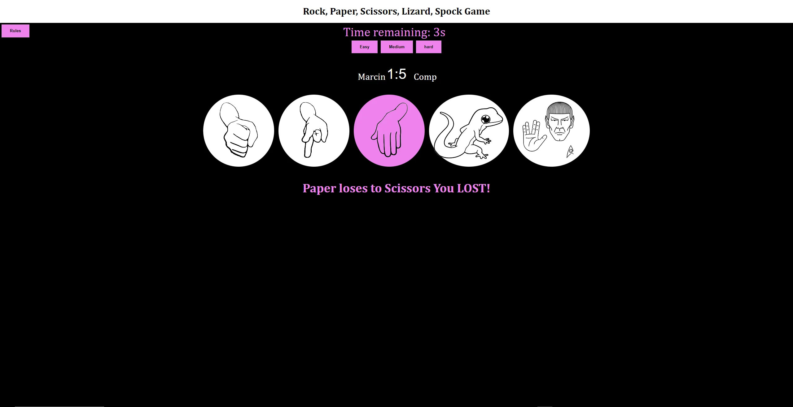

# Rock Paper Scissors Lizard Spock Game

Hello and welcome, in this project you can see basic information about the rock, scissors, paper, lizard, and Spock game. 

## Introduction
This project is an implementation of the classic "Rock, Paper, Scissors" game, extended to include "Lizard" and "Spock" for additional complexity and fun. The game features a dynamic timer mechanism, multiple difficulty levels, and a modal with instructions on how to play.

## How to Play
1. **Choose Difficulty**:
    - Enter your name in the prompt widow
        - Please player needs to type in his name to start the game.

    - Select a difficulty level by clicking on one of the buttons labeled "Easy", "Medium", or "Hard".
    - Each difficulty level has a different timer duration:
      - Easy: 4 seconds
      - Medium: 3 seconds
      - Hard: 2 second

2. **Play the Game**:
   - Before the timer runs out, choose one of the five options: Rock, Paper, Scissors, Lizard, or Spock by clicking the respective button.

   - If you fail to choose before the timer expires, the computer automatically wins the round.

3. **View Results**:
   - The result of the round is displayed on the screen, indicating whether you won, lost, or drew.
   - Scores are updated accordingly for both the user and the computer.
   

## Game Rules
The extended rules for "Rock, Paper, Scissors, Lizard, Spock" are as follows:
- **Rock** crushes **Scissors**
- **Rock** crushes **Lizard**
- **Paper** covers **Rock**
- **Paper** disproves **Spock**
- **Scissors** cut **Paper**
- **Scissors** decapitate **Lizard**
- **Lizard** eats **Paper**
- **Lizard** poisons **Spock**
- **Spock** smashes **Scissors**
- **Spock** vaporizes **Rock**

## Features
- **Dynamic Timer**: The timer resets each time you click on one of the game options (Rock, Paper, Scissors, Lizard, or Spock).
- **Score Tracking**: The game keeps track of both the user's and the computer's scores, displaying them in real-time.
- **Responsive Messages**: The game displays messages indicating the result of each round.
- **Rules Modal**: A modal window that displays the rules of the game can be opened and closed for reference.

# Features of the game The game have a 5 navigating options to choose from:
* Option one is an image of the fist as a rock in the game.
* Option two is an image of two fingers as scissors in the game.
* Option three is an image of an open hand as a paper in the game.
* Option four is an image of a lizard drawn as a lizard in a game.
* Option five is an image of Spock's character from startrek.
* Each option has a white background, when the user points their cursor at it color changes to violet.
* Each option is clickable, and after clicking the game approves the selection. 
* Each time the user selects one of the options there is a score increase. 
* Each time the user wins or loses the information is displayed in violet color under the options for the player's choice.

# Future features 
* The game could store the date time and score for a user to keep records of winning and what day the user spent most time playing the game.

# Code Explanation

## Variables
- 'userScore' and 'compScore': Variables to track the scores of the user and the computer.
- 'userScoreSpan' and 'compScoreSpan': Elements to display the user's and computer's scores respectively.
- 'resultP': Element to display the result message of each round.
- Game option elements ('rockDiv', 'paperDiv', 'scissoresDiv', 'lizardDiv', 'spockDiv'): Elements corresponding to each game option used to attach event listeners.

## Timer Functions
- 'startTimer(seconds)':
  - Starts a countdown timer with the specified duration in seconds.
  - Clears any existing timer interval to prevent multiple timers from running simultaneously.
  - Updates the timer display every second.
  - Shows a message and updates the computer's score if the timer runs out.
 
- 'resetTimer()':
  - Resets the timer to the current duration when a game option is clicked.
  - Ensures the timer restarts with the same duration that was initially set.

## Game Functions
- 'getComputerChoice()':
  - Randomly selects one of the game options for the computer from an array of choices.
 
- 'coverLetter(letter)':
  - Converts the shorthand letter representing a game option to its full name for display purposes.
 
- 'win(userChoice, computerChoice)':
  - Increments the user's score and updates the score display.
  - Displays a win message indicating the user's choice and the computer's choice.
 
- 'lose(userChoice, computerChoice)':
  - Increments the computer's score and updates the score display.
  - Displays a lose message indicating the user's choice and the computer's choice.
 
- 'draw(userChoice, computerChoice)':
  - Displays a draw message indicating that both choices are the same.
 
- 'game(userChoice)':
  - The main game logic determines the result of each round based on the user's and computer's choices.
  - Uses a switch statement to apply the game rules and calls the appropriate function ('win', 'lose', or 'draw') based on the result.

## Modal Functions
- 'openModal()', 'closeModal()', 'outsideClick(e)':
- Functions to handle the opening, closing, and outside click detection for the modal displaying the game rules.

## Initialization
- 'main()':
- Sets up event listeners for the game option elements to start the game when clicked.
 
- 'document.addEventListener("DOMContentLoaded", (event) => { main(); });':
- Ensures the game initializes and sets up event listeners after the DOM is fully loaded.

# Getting Started
To run the game, simply open the 'index.html' file in a web browser. The game interface will appear, you will have to enter your name. Then you get access and allows you to enter the game. Select a difficulty level and start playing immediately. You can further customize the game by modifying the JavaScript and CSS files.

# Typography and color scheme 
I use the colors white, black and violet. I believe is good contrast and readable for users.
I use font built-in VCS - "Cambria, Cochin, Georgia, Times, 'Times New Roman', serif;" 
I use font Siza to be easily readable for the user. 

# Technology 
* Main technology 
* Tower PC with Windows 10 Pro
    * Visual studio code
        * HTML language to write code
        * CSS to style the website
        * JavaScript for the game engine 
        * Live server future to review code
    * Google browser 
        * Google inspects
* GitHub and Git 
    * Display repository 
* Committing code to the repository 
* HTML code Validator
* CSS code Validator 
* Grammarly for grammar and spelling mistakes.

# Testing 
* Tested in HTML code validator [link to HTML validator](https://validator.w3.org/)

    
* Tested CSS code validator [link to CSS validator](https://jigsaw.w3.org/css-validator/)

    

* Lighthouse test by Google inspects tool. 
* Lighthouse test Computer:

* Lighthouse test Mobile:

 * The browser test is complete works correctly and displaying on Chrome and Microsoft Edge browsers.
 * Microsoft browser Test: 

 * Google Chrome browser Test:

* Test for user choices in-game:
    * There are 5 options to choose after the user's choice he should find out if he won, lost or drew with an opponent.
    * The test will also show the ability of random choice of the computer.
    * The first test is to check random choice for the computer's

    * Test for "Rock" choice for user 
     
    * Rock is picked for the user when you point it cursor at it the background color changes to violet.
    * After the user clicks it automatically computer makes a random choice. 
    * Test for "Scissors" choice for user

    * Scissors are picked for the user when you point it cursor at them the background color changes to violet.
    * After the user clicks it automatically computer makes a random choice. 
    * Test for "Paper" choice for user
    
    * When Paper is picked for the user when you point the cursor at it the background color changes to violet.
    * After the user clicks the computer makes his random choice. 
    * Test for "Lizard" choice for user
    * Lizard is picked for the user when you point it cursor at it the background color changes to violet.
        
    * After the user clicks it automatically computer makes a random choice.
    * Test for "Spock" choice for user
        
    * Spock is picked for the user when you point it cursor at it the background color changes to violet.
    * After the user clicks it automatically computer makes a random choice.
    * Test for scoreboard for user:
    * The score goes up by one every time the user wins
    * The score for the computer goes up by one every time wins. 
        

# Bugs and errors 
 * typing mistakes 
 * semi-colon missing  
 * colon missing 
 * brackets missing

    * to fix it I had to review the code find all the missing attributes and place it in the right order.  

* Type of file jpeg or png, images were file was converted to WebP for the quicker load on the page.
    * To fix it had to use a tool to convert images from PNG to WebP.

# Deployment

* This website was deployed to the GitHub page as my repository the steps are below.
* In GitHub navigate to the repository Click on setting ( last section on navbar)
    * Find "Pages" on the drop-down menu 
    * left-hand side of the drop-down many find Build and Deployment
    * choose to deploy from a branch below choose the main branches and root folder 
    * save
* The dev environment was VS code, in which the code was written. The steps to Deploy to Github: Open the GitHub page on my account, click Create a new repository, and type in the repository name. 
    * Opened VS code dev environment, found the terminal on the top navbar, and clicked new terminal. Take instructions from GitHub and type in the terminal 
        * echo "# new" >> README.md
        git init
        git add README.md
        git commit -m "first commit"
        git branch -M main
        git remote add origin https://github.com/Cinula/new.git
        git push -u origin main 

# Conclusion
This project provides an interactive and enjoyable way to play the extended "Rock, Paper, Scissors, Lizard, Spock" game. It includes dynamic timers, real-time score tracking, and an intuitive user interface. Feel free to explore the code, understand the logic, and enhance the game with additional features or improvements.

# Acknowledgments
- The extended game rules are derived from the TV show "The Big Bang Theory".
- The project was developed to demonstrate the integration of JavaScript functionalities for a web-based game.

# Credits
* Content
    * The information for the game Rock, paper, scissors, lizard, Spock game was taken from Code Institute from idea example 1.
    * Code institute and love Math projects helped me a lot in understanding a lot of content. I gathered the information for a better understanding of the game engine and how to create JavaScript on YouTube the links are below: 
    [link for Youtube ](https://www.youtube.com/watch?v=jaVNP3nIAv0&t=2160s)YouTube [link for](https://www.youtube.com/watch?v=3uKdQx-SZ5A&t=560s) 
    [link for Youtube](https://www.youtube.com/watch?v=3uKdQx-SZ5A&t=560s)
* Media
    * The images were gathered from an open-source site, google image gallery [link](https://www.google.com/search?sca_esv=465def9e32fd9f0d&rlz=1C1GCEA_enGB1059GB1059&q=rock+paper+scissors+lizard+spock+game&uds=ADvngMjcH0KdF7qGWtwTBrP0nt7dvLoggNxpdGkAiBQjXtRmgS7h_WkRexDqwbVO70YOqdwuzRfDGVLKBvJHZ9Jx2BlkLQxomtLPO098xmlk5bBMgElJKm7_6FoP8LFzEgKmkkbSGlON_2Xw2he7hlXnJ-SE4DdWwSE2RA_peW4uNgp5Yxh0fJc&udm=2&sa=X&ved=2ahUKEwjqpPWbsYeKAxXTgv0HHQ0vKxYQxKsJegQIChAB&ictx=0&biw=1600&bih=747&dpr=1.2)
    
    * Rock [link](https://www.google.com/search?q=rock+paper+scissors&sca_esv=465def9e32fd9f0d&rlz=1C1GCEA_enGB1059GB1059&udm=2&biw=1600&bih=747&ei=FMVMZ9WgGseM9u8PlNj9mA4&oq=rock+paper+sci&gs_lp=EgNpbWciDnJvY2sgcGFwZXIgc2NpKgIIADIKEAAYgAQYQxiKBTIKEAAYgAQYQxiKBTIKEAAYgAQYQxiKBTIKEAAYgAQYQxiKBTIKEAAYgAQYQxiKBTIFEAAYgAQyBRAAGIAEMgUQABiABDIFEAAYgAQyBRAAGIAESOHMBlCSAljfxAZwBHgAkAEAmAHZAaABqgeqAQUwLjUuMbgBA8gBAPgBAZgCCqACjQjCAgYQABgHGB7CAgcQABiABBgKmAMAiAYBkgcFNC41LjGgB4wn&sclient=img#vhid=BzqF9c6c3xuSSM&vssid=mosaic)

    * Scissors [link](https://www.google.com/search?q=rock+paper+scissors&sca_esv=465def9e32fd9f0d&rlz=1C1GCEA_enGB1059GB1059&udm=2&biw=1600&bih=747&ei=FMVMZ9WgGseM9u8PlNj9mA4&oq=rock+paper+sci&gs_lp=EgNpbWciDnJvY2sgcGFwZXIgc2NpKgIIADIKEAAYgAQYQxiKBTIKEAAYgAQYQxiKBTIKEAAYgAQYQxiKBTIKEAAYgAQYQxiKBTIKEAAYgAQYQxiKBTIFEAAYgAQyBRAAGIAEMgUQABiABDIFEAAYgAQyBRAAGIAESOHMBlCSAljfxAZwBHgAkAEAmAHZAaABqgeqAQUwLjUuMbgBA8gBAPgBAZgCCqACjQjCAgYQABgHGB7CAgcQABiABBgKmAMAiAYBkgcFNC41LjGgB4wn&sclient=img#vhid=XPN8LLs8DFOWsM&vssid=mosaic)

    * Papper [link](https://www.google.com/search?q=rock+paper+scissors&sca_esv=465def9e32fd9f0d&rlz=1C1GCEA_enGB1059GB1059&udm=2&biw=1600&bih=747&ei=FMVMZ9WgGseM9u8PlNj9mA4&oq=rock+paper+sci&gs_lp=EgNpbWciDnJvY2sgcGFwZXIgc2NpKgIIADIKEAAYgAQYQxiKBTIKEAAYgAQYQxiKBTIKEAAYgAQYQxiKBTIKEAAYgAQYQxiKBTIKEAAYgAQYQxiKBTIFEAAYgAQyBRAAGIAEMgUQABiABDIFEAAYgAQyBRAAGIAESOHMBlCSAljfxAZwBHgAkAEAmAHZAaABqgeqAQUwLjUuMbgBA8gBAPgBAZgCCqACjQjCAgYQABgHGB7CAgcQABiABBgKmAMAiAYBkgcFNC41LjGgB4wn&sclient=img#vhid=gp9mxyrI1MobWM&vssid=mosaic)

    * Lizard [link](https://www.google.com/search?q=+lizarad+drawing&sca_esv=465def9e32fd9f0d&rlz=1C1GCEA_enGB1059GB1059&udm=2&biw=1600&bih=747&ei=OchMZ4PYJayP9u8PqvmJyQk&ved=0ahUKEwjD2MTRtYeKAxWsh_0HHap8IpkQ4dUDCBA&uact=5&oq=+lizarad+drawing&gs_lp=EgNpbWciECBsaXphcmFkIGRyYXdpbmdI6A9Q0AZY2ApwAXgAkAEAmAGHAaAB9wOqAQMwLjS4AQPIAQD4AQGYAgCgAgCYAwDiAwUSATEgQIgGAZIHAKAHtAE&sclient=img)

    * Spock [link] (https://www.google.com/search?q=spock+drawing&sca_esv=465def9e32fd9f0d&rlz=1C1GCEA_enGB1059GB1059&udm=2&biw=1600&bih=747&ei=wMhMZ63NM8uB9u8P08PJ8AQ&ved=0ahUKEwitrYKStoeKAxXLgP0HHdNhEk4Q4dUDCBA&uact=5&oq=spock+drawing&gs_lp=EgNpbWciDXNwb2NrIGRyYXdpbmcyBRAAGIAEMgUQABiABDIGEAAYBRgeMgYQABgFGB4yBhAAGAgYHjIGEAAYCBgeMgYQABgIGB4yBhAAGAgYHkj_E1C2BVjyEXABeACQAQCYAX2gAboHqgEDMC44uAEDyAEA-AEBmAIJoAL2B8ICChAAGIAEGEMYigXCAgYQABgHGB7CAgcQABiABBgKwgIEEAAYHsICBhAAGAoYHpgDAIgGAZIHAzEuOKAHqig&sclient=img#vhid=KQ0SP844FqnioM&vssid=mosaic)